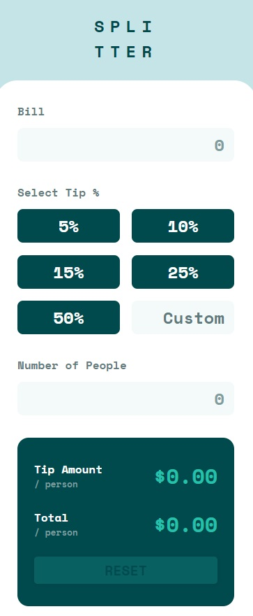
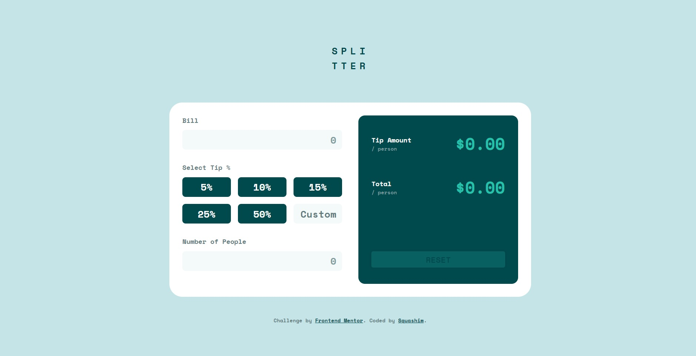

## Welcome! 👋

# Frontend Mentor - Tip calculator app

## Table of contents

- [Overview](#overview)
- [The challenge](#the-challenge)
- [Screenshot](#screenshot) 
- [Links](#links)
- [Built with](#built-with)
- [Author](#author)

## Overview

## The challenge

Your users should be able to:

- View the optimal layout for the app depending on their device's screen size
- See hover states for all interactive elements on the page
- Calculate the correct tip and total cost of the bill per person

### Screenshot

<table>
        <tr>
            <td>
                
            </td>
            <td>
                
            </td>
        </tr>
</table>

### Links

- Solution URL: [https://www.frontendmentor.io/solutions/responsive-tip-calculator-with-sass-and-js-1h6uT16RpH](https://www.frontendmentor.io/solutions/responsive-tip-calculator-with-sass-and-js-1h6uT16RpH)
- Live Site URL: [https://squashim.github.io/tip-calculator/](https://squashim.github.io/tip-calculator/)

### Built with

- Semantic HTML5 markup
- CSS custom properties
- Flexbox
- Grid
- SCSS
- Vanilla JS

## Author

- Website - [@Squashim](https://github.com/Squashim)
- Frontend Mentor - [@Squashim](https://www.frontendmentor.io/profile/Squashim)

**Have fun building!** 🚀
